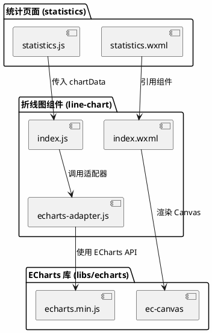
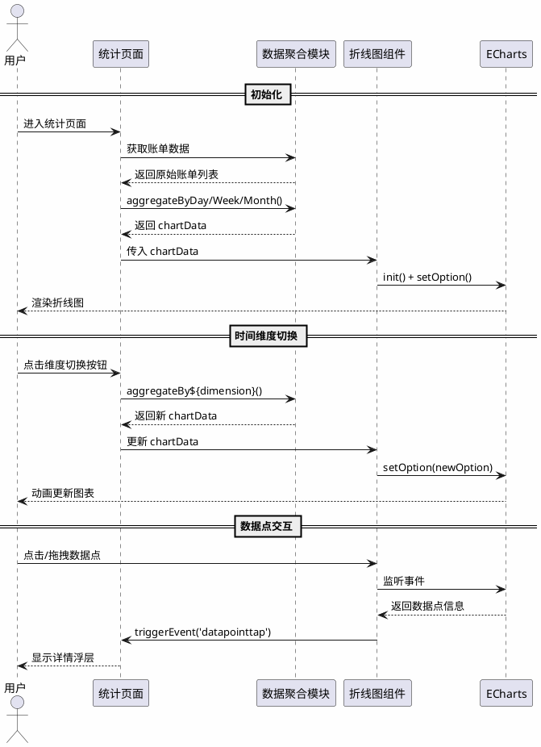
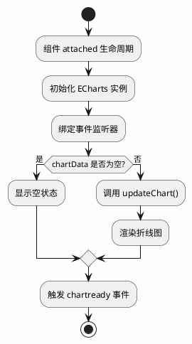

# 折线图组件技术设计文档

## 1. 概述

### 1.1 文档目的

本文档详细描述记账小程序中折线图组件的技术设计方案，包括技术选型、架构设计、接口设计、数据模型、实现细节等内容。

### 1.2 需求概述

| 需求项 | 描述 |
|--------|------|
| 折线图渲染 | 在统计页面展示收支趋势折线图，支持收入/支出双线 |
| 时间维度切换 | 支持日/周/月三种时间维度切换 |
| 数据交互 | 支持数据点点击查看详情，支持拖拽查看 |
| 视觉效果 | 渐变填充、动画效果、响应式布局 |
| 组件复用 | 高度可配置，支持多页面复用 |

### 1.3 用户确认事项

| 确认项 | 用户反馈 |
|--------|----------|
| 横屏展示 | ❌ 不需要 |
| 数据点拖拽查看 | ✅ 需要 |
| 导出图表为图片 | ❌ 不需要 |

---

## 2. 技术选型

### 2.1 图表库选型

**最终选择：ECharts for 微信小程序**

| 对比项 | ECharts for Weixin | wx-charts | Canvas 2D 原生 |
|--------|-------------------|-----------|---------------|
| 功能完整度 | ⭐⭐⭐⭐⭐ | ⭐⭐⭐ | ⭐ |
| 动画效果 | ⭐⭐⭐⭐⭐ | ⭐⭐⭐ | 需自实现 |
| 拖拽交互 | ⭐⭐⭐⭐⭐ | ⭐⭐ | 需自实现 |
| 文档完善度 | ⭐⭐⭐⭐⭐ | ⭐⭐⭐ | N/A |
| 包体积 | ~300KB | ~50KB | 0 |
| 维护活跃度 | 活跃 | 不活跃 | N/A |
| **推荐度** | ⭐⭐⭐⭐⭐ | ⭐⭐⭐ | ⭐⭐ |

**选型理由**：
1. **功能完整**：内置折线图、渐变填充、动画、拖拽交互等所需功能
2. **拖拽支持**：原生支持 dataZoom 组件，满足拖拽查看需求
3. **社区成熟**：GitHub 8.7k+ stars，问题解决方案丰富
4. **性能优化**：支持按需引入，可控制包体积

### 2.2 引入方式

采用**下载源码方式**引入，便于后续定制和调试：

```
libs/
└── echarts/
    ├── echarts.min.js      # ECharts 核心库
    └── ec-canvas/
        ├── ec-canvas.js    # 小程序适配组件
        ├── ec-canvas.wxml
        ├── ec-canvas.wxss
        └── ec-canvas.json
```

---

## 3. 架构设计

### 3.1 组件架构



### 3.2 数据流设计



### 3.3 文件结构

```
components/
└── line-chart/
    ├── index.js           # 组件逻辑（属性、方法、生命周期）
    ├── index.wxml         # 组件模板（Canvas 容器、时间维度切换、图例）
    ├── index.wxss         # 组件样式
    ├── index.json         # 组件配置
    └── echarts-adapter.js # ECharts 适配器（封装初始化、配置、事件）

libs/
└── echarts/
    ├── echarts.min.js     # ECharts 核心库（按需定制版本）
    └── ec-canvas/
        ├── ec-canvas.js   # 小程序 Canvas 适配组件
        ├── ec-canvas.wxml
        ├── ec-canvas.wxss
        └── ec-canvas.json

pages/
└── statistics/
    ├── statistics.js      # [修改] 新增数据聚合方法、维度切换逻辑
    ├── statistics.wxml    # [修改] 新增折线图组件引用
    ├── statistics.wxss    # [修改] 新增折线图相关样式
    └── statistics.json    # [修改] 注册折线图组件
```

---

## 4. 接口设计

### 4.1 组件属性 (Properties)

```javascript
// components/line-chart/index.js
Component({
  properties: {
    /**
     * 图表数据
     * @type {Object}
     * @example { dates: ['3/1', '3/2'], incomes: [100, 200], expenses: [50, 80] }
     */
    chartData: {
      type: Object,
      value: { dates: [], incomes: [], expenses: [] }
    },

    /**
     * 时间维度类型
     * @type {String}
     * @enum {day, week, month}
     */
    dimension: {
      type: String,
      value: 'day'
    },

    /**
     * 是否显示图例
     * @type {Boolean}
     */
    showLegend: {
      type: Boolean,
      value: true
    },

    /**
     * 是否显示网格线
     * @type {Boolean}
     */
    showGrid: {
      type: Boolean,
      value: true
    },

    /**
     * 是否启用拖拽查看
     * @type {Boolean}
     */
    enableDrag: {
      type: Boolean,
      value: true
    },

    /**
     * 图表高度（单位：rpx）
     * @type {Number}
     */
    height: {
      type: Number,
      value: 400
    }
  }
})
```

### 4.2 组件事件 (Events)

| 事件名 | 描述 | 回调参数 |
|--------|------|----------|
| `datapointtap` | 数据点点击事件 | `{ date, income, expense, dataIndex }` |
| `dimensionchange` | 时间维度切换事件 | `{ dimension: 'day' \| 'week' \| 'month' }` |
| `chartready` | 图表渲染完成事件 | `{ instance: EChartsInstance }` |

### 4.3 组件方法 (Methods)

```javascript
// 组件内部方法
methods: {
  /**
   * 初始化图表
   * @returns {void}
   */
  initChart() {},

  /**
   * 更新图表配置
   * @param {Object} chartData - 图表数据
   * @returns {void}
   */
  updateChart(chartData) {},

  /**
   * 获取 ECharts 实例
   * @returns {EChartsInstance}
   */
  getEChartsInstance() {},

  /**
   * 显示数据点详情浮层
   * @param {Object} data - 数据点信息
   * @returns {void}
   */
  showTooltip(data) {},

  /**
   * 隐藏数据点详情浮层
   * @returns {void}
   */
  hideTooltip() {}
}
```

### 4.4 数据聚合接口

在统计页面新增数据聚合方法：

```javascript
// pages/statistics/statistics.js

/**
 * 按天聚合数据（最近7天）
 * @param {Array} bills - 原始账单数据
 * @returns {Object} chartData
 */
aggregateByDay(bills) {
  // 生成最近7天的日期数组
  // 聚合每天的收入和支出
  // 返回 { dates, incomes, expenses }
}

/**
 * 按周聚合数据（最近4周）
 * @param {Array} bills - 原始账单数据
 * @returns {Object} chartData
 */
aggregateByWeek(bills) {
  // 计算最近4周的起止日期
  // 聚合每周的收入和支出
  // 返回 { dates, incomes, expenses }
}

/**
 * 按月聚合数据（最近6个月）
 * @param {Array} bills - 原始账单数据
 * @returns {Object} chartData
 */
aggregateByMonth(bills) {
  // 生成最近6个月的月份数组
  // 聚合每月的收入和支出
  // 返回 { dates, incomes, expenses }
}
```

---

## 5. 数据模型设计

### 5.1 图表数据模型 (ChartData)

```typescript
/**
 * 图表数据结构
 */
interface ChartData {
  /** 日期标签数组 */
  dates: string[];

  /** 收入金额数组（单位：分） */
  incomes: number[];

  /** 支出金额数组（单位：分） */
  expenses: number[];
}
```

**示例数据**：

```javascript
// 日维度示例
{
  dates: ['3/1', '3/2', '3/3', '3/4', '3/5', '3/6', '3/7'],
  incomes: [0, 500000, 0, 0, 800000, 0, 0],      // 单位：分
  expenses: [35000, 128000, 56000, 89000, 45000, 67000, 98000]
}

// 周维度示例
{
  dates: ['2/19-2/25', '2/26-3/3', '3/4-3/10', '3/11-3/17'],
  incomes: [1000000, 500000, 800000, 0],
  expenses: [350000, 420000, 380000, 250000]
}

// 月维度示例
{
  dates: ['10月', '11月', '12月', '1月', '2月', '3月'],
  incomes: [8000000, 8500000, 9000000, 8000000, 7500000, 6000000],
  expenses: [6500000, 7000000, 8500000, 6800000, 6200000, 5000000]
}
```

### 5.2 数据点详情模型 (DataPointInfo)

```typescript
/**
 * 数据点详情
 */
interface DataPointInfo {
  /** 日期/时间段 */
  date: string;

  /** 收入金额（单位：分） */
  income: number;

  /** 支出金额（单位：分） */
  expense: number;

  /** 数据索引 */
  dataIndex: number;
}
```

### 5.3 ECharts 配置模型 (ChartOption)

```javascript
/**
 * ECharts 折线图配置
 */
const chartOption = {
  // 网格配置
  grid: {
    left: '3%',
    right: '4%',
    bottom: '3%',
    top: '10%',
    containLabel: true
  },

  // 提示框配置
  tooltip: {
    trigger: 'axis',
    confine: true,
    formatter: function(params) {
      // 自定义格式化函数
    }
  },

  // 图例配置
  legend: {
    data: ['收入', '支出'],
    bottom: 0
  },

  // X轴配置
  xAxis: {
    type: 'category',
    boundaryGap: false,
    data: [] // 动态填充
  },

  // Y轴配置
  yAxis: {
    type: 'value',
    axisLabel: {
      formatter: '{value}'
    }
  },

  // 数据缩放（拖拽查看）
  dataZoom: [{
    type: 'inside',
    start: 0,
    end: 100
  }],

  // 系列配置
  series: [
    {
      name: '收入',
      type: 'line',
      smooth: true,
      symbol: 'circle',
      symbolSize: 8,
      lineStyle: { color: '#07C160', width: 2 },
      areaStyle: {
        color: {
          type: 'linear',
          x: 0, y: 0, x2: 0, y2: 1,
          colorStops: [
            { offset: 0, color: 'rgba(7, 193, 96, 0.3)' },
            { offset: 1, color: 'rgba(7, 193, 96, 0.05)' }
          ]
        }
      },
      itemStyle: { color: '#07C160' },
      data: [] // 动态填充
    },
    {
      name: '支出',
      type: 'line',
      smooth: true,
      symbol: 'circle',
      symbolSize: 8,
      lineStyle: { color: '#FA5151', width: 2 },
      areaStyle: {
        color: {
          type: 'linear',
          x: 0, y: 0, x2: 0, y2: 1,
          colorStops: [
            { offset: 0, color: 'rgba(250, 81, 81, 0.3)' },
            { offset: 1, color: 'rgba(250, 81, 81, 0.05)' }
          ]
        }
      },
      itemStyle: { color: '#FA5151' },
      data: [] // 动态填充
    }
  ],

  // 动画配置
  animation: true,
  animationDuration: 300,
  animationEasing: 'cubicOut'
};
```

---

## 6. 实现细节

### 6.1 组件初始化流程



### 6.2 数据聚合实现

#### 6.2.1 按天聚合

```javascript
/**
 * 按天聚合数据（最近7天）
 * @param {Array} bills - 原始账单数据
 * @returns {Object} chartData
 */
aggregateByDay(bills) {
  const dayjs = require('dayjs');
  const dates = [];
  const incomes = [];
  const expenses = [];

  // 生成最近7天的日期
  for (let i = 6; i >= 0; i--) {
    const date = dayjs().subtract(i, 'day');
    const dateStr = date.format('M/D');
    const fullDateStr = date.format('YYYY-MM-DD');

    dates.push(dateStr);

    // 聚合当天的收支数据
    const dayBills = bills.filter(bill => {
      const billDate = bill.time ? bill.time.split(' ')[0] : bill.date;
      return billDate === fullDateStr;
    });

    const dayIncome = dayBills
      .filter(b => b.transactionType === 1 || b.amount < 0)
      .reduce((sum, b) => sum + Math.abs(b.amount), 0);

    const dayExpense = dayBills
      .filter(b => b.transactionType === 2 || b.amount > 0)
      .reduce((sum, b) => sum + Math.abs(b.amount), 0);

    incomes.push(dayIncome);
    expenses.push(dayExpense);
  }

  return { dates, incomes, expenses };
}
```

#### 6.2.2 按周聚合

```javascript
/**
 * 按周聚合数据（最近4周）
 * @param {Array} bills - 原始账单数据
 * @returns {Object} chartData
 */
aggregateByWeek(bills) {
  const dayjs = require('dayjs');
  const weekOfYear = require('dayjs/plugin/weekOfYear');
  dayjs.extend(weekOfYear);

  const dates = [];
  const incomes = [];
  const expenses = [];

  // 生成最近4周的周范围
  for (let i = 3; i >= 0; i--) {
    const weekStart = dayjs().subtract(i, 'week').startOf('week');
    const weekEnd = dayjs().subtract(i, 'week').endOf('week');

    const dateStr = `${weekStart.format('M/D')}-${weekEnd.format('M/D')}`;
    dates.push(dateStr);

    // 聚合当周的收支数据
    const weekBills = bills.filter(bill => {
      const billDate = dayjs(bill.time ? bill.time.split(' ')[0] : bill.date);
      return billDate.isAfter(weekStart.subtract(1, 'day')) &&
             billDate.isBefore(weekEnd.add(1, 'day'));
    });

    const weekIncome = weekBills
      .filter(b => b.transactionType === 1 || b.amount < 0)
      .reduce((sum, b) => sum + Math.abs(b.amount), 0);

    const weekExpense = weekBills
      .filter(b => b.transactionType === 2 || b.amount > 0)
      .reduce((sum, b) => sum + Math.abs(b.amount), 0);

    incomes.push(weekIncome);
    expenses.push(weekExpense);
  }

  return { dates, incomes, expenses };
}
```

#### 6.2.3 按月聚合

```javascript
/**
 * 按月聚合数据（最近6个月）
 * @param {Array} bills - 原始账单数据
 * @returns {Object} chartData
 */
aggregateByMonth(bills) {
  const dayjs = require('dayjs');
  const dates = [];
  const incomes = [];
  const expenses = [];

  // 生成最近6个月的月份
  for (let i = 5; i >= 0; i--) {
    const monthDate = dayjs().subtract(i, 'month');
    const dateStr = monthDate.format('M月');
    const yearMonth = monthDate.format('YYYY-MM');

    dates.push(dateStr);

    // 聚合当月的收支数据
    const monthBills = bills.filter(bill => {
      const billDate = bill.time ? bill.time.split(' ')[0] : bill.date;
      return billDate.startsWith(yearMonth);
    });

    const monthIncome = monthBills
      .filter(b => b.transactionType === 1 || b.amount < 0)
      .reduce((sum, b) => sum + Math.abs(b.amount), 0);

    const monthExpense = monthBills
      .filter(b => b.transactionType === 2 || b.amount > 0)
      .reduce((sum, b) => sum + Math.abs(b.amount), 0);

    incomes.push(monthIncome);
    expenses.push(monthExpense);
  }

  return { dates, incomes, expenses };
}
```

### 6.3 拖拽交互实现

使用 ECharts 内置的 `dataZoom` 组件实现拖拽查看功能：

```javascript
// echarts-adapter.js

/**
 * 生成带拖拽功能的图表配置
 */
generateChartOption(chartData, enableDrag) {
  const baseOption = {
    // ... 基础配置
  };

  // 如果启用拖拽，添加 dataZoom 配置
  if (enableDrag && chartData.dates.length > 7) {
    baseOption.dataZoom = [{
      type: 'inside',     // 支持手势拖拽
      start: 0,
      end: 100,
      minValueSpan: 7     // 最少显示7个数据点
    }];
  }

  return baseOption;
}
```

### 6.4 动画效果实现

```javascript
// echarts-adapter.js

/**
 * 图表动画配置
 */
const animationConfig = {
  // 启用动画
  animation: true,

  // 首次渲染动画时长
  animationDuration: 300,

  // 缓动效果
  animationEasing: 'cubicOut',

  // 数据更新动画
  animationDurationUpdate: 200,
  animationEasingUpdate: 'cubicInOut'
};

/**
 * 更新图表数据（带动画）
 */
updateChartData(chartInstance, newOption) {
  chartInstance.setOption(newOption, {
    notMerge: false,      // 合并配置
    lazyUpdate: false     // 立即更新
  });
}
```

---

## 7. 样式设计

### 7.1 配色方案

| 元素 | 颜色值 | 用途 |
|------|--------|------|
| 收入线 | `#07C160` | 折线、数据点 |
| 收入区域 | `rgba(7, 193, 96, 0.3)` → `rgba(7, 193, 96, 0.05)` | 渐变填充 |
| 支出线 | `#FA5151` | 折线、数据点 |
| 支出区域 | `rgba(250, 81, 81, 0.3)` → `rgba(250, 81, 81, 0.05)` | 渐变填充 |
| 网格线 | `#E5E5E5` | Y轴网格 |
| X轴文字 | `#666666` | 日期标签 |
| Y轴文字 | `#999999` | 金额刻度 |

### 7.2 组件样式

```css
/* components/line-chart/index.wxss */

/* 折线图容器 */
.line-chart-container {
  background-color: #ffffff;
  border-radius: 20rpx;
  padding: 30rpx;
  margin-bottom: 20rpx;
}

/* 标题栏 */
.chart-header {
  display: flex;
  justify-content: space-between;
  align-items: center;
  margin-bottom: 20rpx;
}

.chart-title {
  font-size: 32rpx;
  font-weight: bold;
  color: #333333;
}

/* 时间维度切换按钮组 */
.dimension-tabs {
  display: flex;
  background-color: #f5f5f5;
  border-radius: 30rpx;
  padding: 4rpx;
}

.dimension-tab {
  padding: 10rpx 24rpx;
  font-size: 24rpx;
  color: #666666;
  border-radius: 26rpx;
  transition: all 0.2s ease;
}

.dimension-tab.active {
  background-color: #6c72cb;
  color: #ffffff;
}

/* Canvas 容器 */
.chart-canvas {
  width: 100%;
  height: 400rpx;
}

/* 空状态 */
.empty-state {
  display: flex;
  flex-direction: column;
  align-items: center;
  justify-content: center;
  height: 400rpx;
  color: #999999;
}

.empty-icon {
  font-size: 80rpx;
  margin-bottom: 20rpx;
}

.empty-text {
  font-size: 28rpx;
}

/* 图例 */
.chart-legend {
  display: flex;
  justify-content: center;
  gap: 40rpx;
  margin-top: 20rpx;
}

.legend-item {
  display: flex;
  align-items: center;
  gap: 10rpx;
  font-size: 24rpx;
  color: #666666;
}

.legend-dot {
  width: 16rpx;
  height: 16rpx;
  border-radius: 50%;
}

.legend-dot.income {
  background-color: #07C160;
}

.legend-dot.expense {
  background-color: #FA5151;
}
```

---

## 8. 改动点汇总

### 8.1 新增文件

| 文件路径 | 描述 | 代码行数（估算） |
|----------|------|------------------|
| `components/line-chart/index.js` | 折线图组件逻辑 | ~200行 |
| `components/line-chart/index.wxml` | 组件模板 | ~50行 |
| `components/line-chart/index.wxss` | 组件样式 | ~100行 |
| `components/line-chart/index.json` | 组件配置 | ~10行 |
| `components/line-chart/echarts-adapter.js` | ECharts 适配器 | ~150行 |
| `libs/echarts/echarts.min.js` | ECharts 核心库 | 引入 |
| `libs/echarts/ec-canvas/*` | 小程序适配组件 | 引入 |

### 8.2 修改文件

| 文件路径 | 改动位置 | 改动内容 |
|----------|----------|----------|
| `pages/statistics/statistics.js` | 新增方法 | 添加 `aggregateByDay()`、`aggregateByWeek()`、`aggregateByMonth()` |
| `pages/statistics/statistics.js` | data 属性 | 新增 `chartData`、`timeDimension` 属性 |
| `pages/statistics/statistics.js` | 新增方法 | 添加 `onDimensionChange()` 方法 |
| `pages/statistics/statistics.wxml` | 新增元素 | 添加时间维度切换按钮组、折线图组件 |
| `pages/statistics/statistics.wxss` | 新增样式 | 添加折线图相关样式 |
| `pages/statistics/statistics.json` | 新增配置 | 注册 `line-chart` 组件 |

### 8.3 架构图（标注改动点）

```plantuml
@startuml
skinparam backgroundColor #FEFEFE
skinparam componentStyle uml2

package "pages/statistics/" {
    [statistics.js] as js #LightBlue **新增方法**
    [statistics.wxml] as wxml #LightBlue **新增组件**
    [statistics.wxss] as wxss #LightBlue **新增样式**
    [statistics.json] as json #LightBlue **新增配置**
}

package "components/line-chart/" #LightGreen **新增** {
    [index.js] as chart_js
    [index.wxml] as chart_view
    [index.wxss] as chart_css
    [index.json] as chart_json
    [echarts-adapter.js] as adapter
}

package "libs/echarts/" #LightYellow **新增** {
    [echarts.min.js] as echarts
    [ec-canvas] as ec_canvas
}

js --> chart_js : 初始化传入 chartData
wxml --> chart_view : <line-chart />
chart_js --> adapter
adapter --> echarts

@enduml
```

---

## 9. 风险与缓解措施

### 9.1 技术风险

| 风险项 | 等级 | 缓解措施 |
|--------|------|----------|
| ECharts 包体积大（~300KB） | 🟡 中 | 使用按需定制版本，仅包含折线图组件 |
| Canvas 内存占用 | 🟢 低 | 组件销毁时主动释放 ECharts 实例 |
| 低版本基础库兼容 | 🟢 低 | 要求基础库 2.10.0+，已是主流版本 |

### 9.2 业务风险

| 风险项 | 等级 | 缓解措施 |
|--------|------|----------|
| 数据量大时聚合性能 | 🟢 低 | 使用缓存机制，避免重复计算 |
| 多实例数据隔离 | 🟢 低 | 组件内部维护独立状态，不共享数据 |

---

## 10. 测试要点

### 10.1 功能测试

| 测试项 | 测试方法 | 预期结果 |
|--------|----------|----------|
| 折线图渲染 | 进入统计页面 | 显示收入/支出双线折线图 |
| 空数据状态 | 清空账单数据 | 显示"暂无数据"提示 |
| 时间维度切换 | 点击日/周/月按钮 | 图表平滑切换显示对应数据 |
| 数据点点击 | 点击折线上的数据点 | 显示详情浮层 |
| 拖拽查看 | 水平滑动图表 | 数据区域跟随移动 |

### 10.2 性能测试

| 测试项 | 测试条件 | 预期结果 |
|--------|----------|----------|
| 首次渲染 | 100条账单数据 | 渲染时间 < 500ms |
| 维度切换 | 已渲染状态下切换 | 切换时间 < 200ms |
| 内存占用 | 频繁切换维度 | 内存无持续增长 |

### 10.3 兼容性测试

| 测试项 | 测试范围 | 预期结果 |
|--------|----------|----------|
| 基础库版本 | 2.10.0 ~ 最新 | 功能正常 |
| 设备适配 | iPhone/Android | 布局正确，无溢出 |

---

## 11. 实施计划

| 阶段 | 任务 | 预计工时 |
|------|------|----------|
| 1. 准备工作 | 引入 ECharts 库，搭建组件骨架 | 0.5天 |
| 2. 核心开发 | 实现折线图渲染、数据聚合逻辑 | 1天 |
| 3. 交互开发 | 实现维度切换、拖拽查看、点击详情 | 0.5天 |
| 4. 样式优化 | 动画效果、视觉优化 | 0.5天 |
| 5. 测试验证 | 功能测试、性能测试、兼容性测试 | 0.5天 |
| **总计** | | **3天** |

---

## 附录

### 附录A：ECharts for 微信小程序引入步骤

1. 下载源码：https://github.com/ecomfe/echarts-for-weixin
2. 复制 `ec-canvas` 目录到 `libs/echarts/`
3. 下载定制版 ECharts：https://echarts.apache.org/zh/builder.html
   - 仅选择：折线图、提示框、图例、数据缩放
4. 替换 `echarts.min.js`
5. 在组件中引用

### 附录B：参考资料

- ECharts 官方文档：https://echarts.apache.org/zh/index.html
- ECharts for 微信小程序：https://github.com/ecomfe/echarts-for-weixin
- 微信小程序 Canvas 文档：https://developers.weixin.qq.com/miniprogram/dev/api/canvas/Canvas.html
