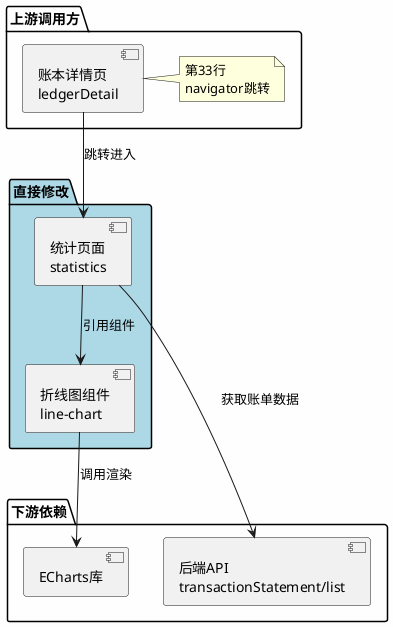

# 折线图组件影响范围分析

## 1. 概述

本文档基于技术设计方案，分析折线图组件对现有系统的影响范围，为QA团队提供测试策略参考。

### 1.1 分析范围

| 分析维度 | 覆盖内容 |
|----------|----------|
| 直接影响 | 被修改的页面、组件、配置文件 |
| 间接影响 | 调用链上下游、共享组件 |
| 数据层影响 | 数据模型、数据流变化 |
| 服务依赖影响 | API调用、第三方库 |
| 测试建议 | 功能测试、回归测试、性能测试 |

---

## 2. 直接影响分析 (Direct Impact)

### 2.1 页面入口影响

| 入口标识 | 修改类型 | 影响程度 | 位置 | 说明 |
|----------|----------|----------|------|------|
| `pages/statistics/statistics` | 修改 | 🔴 高 | `pages/statistics/` | 核心修改页面，新增折线图组件和数据聚合逻辑 |

### 2.2 组件影响

| 组件标识 | 修改类型 | 影响程度 | 位置 | 说明 |
|----------|----------|----------|------|------|
| `line-chart` | 新增 | 🔴 高 | `components/line-chart/` | 新增折线图组件 |
| `ec-canvas` | 新增 | 🟡 中 | `libs/echarts/ec-canvas/` | ECharts 小程序适配组件 |

### 2.3 配置文件影响

| 文件路径 | 修改类型 | 影响程度 | 修改内容 |
|----------|----------|----------|----------|
| `pages/statistics/statistics.json` | 修改 | 🟡 中 | 注册 `line-chart` 组件 |
| `pages/statistics/statistics.js` | 修改 | 🔴 高 | 新增数据聚合方法、维度切换逻辑 |
| `pages/statistics/statistics.wxml` | 修改 | 🔴 高 | 新增折线图组件引用、维度切换按钮 |
| `pages/statistics/statistics.wxss` | 修改 | 🟡 中 | 新增折线图相关样式 |
| `app.json` | 可选修改 | 🟢 低 | 可选：全局注册 `line-chart` 组件 |

### 2.4 第三方库影响

| 库名称 | 引入方式 | 体积影响 | 位置 | 说明 |
|--------|----------|----------|------|------|
| `echarts.min.js` | 新增 | ~300KB | `libs/echarts/` | ECharts 核心库（按需定制版） |
| `ec-canvas` | 新增 | ~10KB | `libs/echarts/ec-canvas/` | 小程序适配组件 |

---

## 3. 间接影响分析 (Indirect Impact)

### 3.1 调用链分析



### 3.2 上游影响分析

| 上游入口 | 影响说明 | 验证要点 |
|----------|----------|----------|
| `pages/ledgerDetail/detail.wxml` 第33行 | 通过 navigator 跳转到统计页面，需验证跳转后页面正常显示 | 1. 从账本详情页跳转到统计页面正常<br>2. 跳转参数 `ledgerNo` 正确传递 |

### 3.3 下游影响分析

| 下游依赖 | 影响说明 | 验证要点 |
|----------|----------|----------|
| ECharts 库 | 新增依赖，需验证库正常加载和运行 | 1. ECharts 库正确加载<br>2. Canvas 渲染正常<br>3. 内存无泄漏 |
| 后端 API `transactionStatement/list` | 复用现有接口，无接口变更 | 1. 数据获取正常<br>2. 数据格式兼容 |

### 3.4 共享组件影响

| 共享组件 | 是否受影响 | 说明 |
|----------|------------|------|
| `bill-list` | 否 | 账单列表组件独立，不受影响 |
| `bill-summary` | 否 | 收支汇总组件独立，不受影响 |
| `budget-card` | 否 | 预算卡片组件独立，不受影响 |
| `income-expense-summary` | 否 | 收支概览组件独立，不受影响 |

---

## 4. 数据层影响分析 (Data Layer Impact)

### 4.1 数据模型变化

| 数据模型 | 变化类型 | 影响范围 | 说明 |
|----------|----------|----------|------|
| `ChartData` | 新增 | 统计页面 | 折线图数据结构：`{ dates, incomes, expenses }` |
| `DataPointInfo` | 新增 | 折线图组件 | 数据点详情结构：`{ date, income, expense, dataIndex }` |

### 4.2 数据流变化

**变更前**：
```
后端API → 原始账单数据 → 按月过滤 → 分类统计 → 页面渲染
```

**变更后**：
```
后端API → 原始账单数据 → 多维度聚合(day/week/month) → chartData → 折线图渲染
                                  ↓
                            分类统计 → 页面渲染（保持不变）
```

### 4.3 数据兼容性

| 兼容性项 | 状态 | 说明 |
|----------|------|------|
| 现有数据结构 | ✅ 兼容 | 复用现有账单数据模型，无破坏性变更 |
| 后端接口 | ✅ 兼容 | 无需后端接口变更 |
| 本地存储 | ✅ 无影响 | 不涉及本地存储变更 |

---

## 5. 服务依赖影响分析 (Service Dependency Impact)

### 5.1 后端服务依赖

| 服务 | 接口 | 影响 | 说明 |
|------|------|------|------|
| 账单服务 | `GET /transactionStatement/list` | 🟢 无变更 | 复用现有接口，前端做数据聚合 |
| 账单服务 | `GET /transactionStatement/summary` | 🟢 无变更 | 现有汇总逻辑保持不变 |

### 5.2 第三方服务依赖

| 服务 | 影响 | 说明 |
|------|------|------|
| ECharts CDN | 不涉及 | 使用本地引入方式，不依赖 CDN |
| 微信 Canvas API | 新增依赖 | 使用微信小程序 Canvas 2D API，基础库要求 2.10.0+ |

### 5.3 配置依赖

| 配置项 | 影响 | 说明 |
|--------|------|------|
| 小程序基础库 | 版本要求 | 需基础库 2.10.0 及以上版本 |
| 小程序包体积 | 增加 ~310KB | ECharts 库体积，需关注包体积限制 |

---

## 6. QA 测试建议 (QA Testing Recommendations)

### 6.1 功能测试范围

#### 6.1.1 核心功能测试

| 测试场景 | 测试步骤 | 预期结果 | 优先级 |
|----------|----------|----------|--------|
| 折线图渲染 | 1. 进入统计页面<br>2. 查看折线图区域 | 显示收入/支出双线折线图，颜色正确 | P0 |
| 空数据状态 | 1. 清空账单数据<br>2. 进入统计页面 | 显示"暂无数据"提示 | P0 |
| 日维度切换 | 1. 点击"日"按钮<br>2. 查看图表 | 显示最近7天数据，X轴显示日期 | P0 |
| 周维度切换 | 1. 点击"周"按钮<br>2. 查看图表 | 显示最近4周数据，X轴显示周范围 | P0 |
| 月维度切换 | 1. 点击"月"按钮<br>2. 查看图表 | 显示最近6个月数据，X轴显示月份 | P0 |
| 数据点点击 | 1. 点击折线图数据点<br>2. 查看详情浮层 | 显示日期、收入、支出金额 | P1 |
| 拖拽查看 | 1. 在图表上水平滑动<br>2. 观察数据区域变化 | 数据区域跟随手势移动 | P1 |
| 图例显示 | 1. 查看图表底部图例 | 显示"收入"绿色圆点、"支出"红色圆点 | P2 |

#### 6.1.2 边界条件测试

| 测试场景 | 测试数据 | 预期结果 | 优先级 |
|----------|----------|----------|--------|
| 全部为收入 | 只有收入账单 | 支出线显示为0，收入线正常显示 | P1 |
| 全部为支出 | 只有支出账单 | 收入线显示为0，支出线正常显示 | P1 |
| 大额金额 | 单笔金额 > 100万 | 图表正常渲染，无溢出 | P2 |
| 数据量多 | 账单数量 > 100条 | 图表渲染时间 < 500ms | P2 |

### 6.2 回归测试范围

#### 6.2.1 必须回归的功能点

| 功能模块 | 测试要点 | 原因 |
|----------|----------|------|
| 统计页面原有功能 | 月度收支概览、分类统计正常显示 | 页面结构修改，需验证原有功能不受影响 |
| 账本详情页跳转 | 从账本详情页跳转到统计页面正常 | 页面路由未变更，但需验证跳转后页面正常 |
| 时间选择器 | 月份切换功能正常 | 页面逻辑修改，需验证现有功能不受影响 |

#### 6.2.2 可选回归的功能点

| 功能模块 | 测试要点 | 原因 |
|----------|----------|------|
| 账本详情页 | 账本详情页各标签页切换正常 | 与统计页面有跳转关联 |
| 账单列表 | 账单列表显示正常 | 共享账单数据模型 |

### 6.3 性能测试建议

| 测试项 | 测试条件 | 验收标准 | 测试工具 |
|--------|----------|----------|----------|
| 首屏渲染时间 | 100条账单数据 | < 500ms | 微信开发者工具性能面板 |
| 维度切换时间 | 已渲染状态下切换维度 | < 200ms | 微信开发者工具性能面板 |
| 内存占用 | 频繁切换维度10次 | 内存无持续增长 | 微信开发者工具内存分析 |
| Canvas 渲染 | 低端设备（如 iPhone 6） | 无明显卡顿 | 真机测试 |

### 6.4 兼容性测试建议

#### 6.4.1 微信版本兼容

| 微信版本 | 基础库版本 | 测试要点 |
|----------|------------|----------|
| 微信 8.0.0+ | 2.10.0+ | 核心功能测试通过 |
| 微信 7.0.0 | 2.9.0 | 预期不支持，显示友好提示 |

#### 6.4.2 设备兼容

| 设备类型 | 测试要点 |
|----------|----------|
| iOS 设备 | 图表渲染正常，手势交互正常 |
| Android 设备 | 图表渲染正常，手势交互正常 |
| 小屏设备（320px宽度） | 布局无溢出，文字可读 |
| 大屏设备（414px宽度） | 布局自适应，无空白区域 |

### 6.5 异常测试建议

| 异常场景 | 模拟方法 | 预期结果 |
|----------|----------|----------|
| 网络异常 | 断开网络后进入页面 | 显示网络错误提示，提供重试按钮 |
| 数据格式异常 | 接口返回异常数据 | 控制台输出错误日志，显示空状态 |
| Canvas 初始化失败 | 模拟 Canvas 创建失败 | 显示友好错误提示 |
| 内存不足 | 大量数据渲染 | 自动采样或限制数据点数量 |

---

## 7. 影响范围图示

### 7.1 系统影响范围图

```plantuml
@startuml
skinparam backgroundColor #FEFEFE

rectangle "小程序包" {
    rectangle "pages/" {
        rectangle "statistics/" #LightBlue **直接修改** {
            [statistics.js] as stats_js
            [statistics.wxml] as stats_wxml
            [statistics.wxss] as stats_wxss
            [statistics.json] as stats_json
        }
        rectangle "ledgerDetail/" {
            [detail.wxml] as detail
        }
    }
    
    rectangle "components/" {
        rectangle "line-chart/" #LightGreen **新增** {
            [index.js] as chart_js
            [index.wxml] as chart_wxml
            [index.wxss] as chart_wxss
        }
    }
    
    rectangle "libs/" {
        rectangle "echarts/" #LightYellow **新增** {
            [echarts.min.js] as echarts
            [ec-canvas] as ec_canvas
        }
    }
}

rectangle "后端服务" {
    [transactionStatement/list] as api
}

detail --> stats_js : 跳转
stats_wxml --> chart_wxml : 引用
chart_js --> echarts : 调用
stats_js --> api : 请求数据

@enduml
```

### 7.2 测试覆盖矩阵

| 影响范围 | 功能测试 | 回归测试 | 性能测试 | 兼容性测试 |
|----------|----------|----------|----------|------------|
| statistics 页面 | ✅ 必须 | ✅ 必须 | ✅ 必须 | ✅ 必须 |
| line-chart 组件 | ✅ 必须 | - | ✅ 必须 | ✅ 必须 |
| ECharts 库 | ✅ 必须 | - | ✅ 必须 | ✅ 必须 |
| ledgerDetail 页面 | - | ✅ 必须 | - | - |
| 后端 API | - | ✅ 可选 | - | - |

---

## 8. 风险评估总结

| 风险项 | 风险等级 | 影响范围 | 缓解措施 |
|--------|----------|----------|----------|
| 包体积增加 | 🟡 中 | 小程序整体 | 使用 ECharts 定制版本，仅包含必要组件 |
| 低版本兼容 | 🟢 低 | 部分用户 | 显示友好提示，引导升级微信版本 |
| Canvas 性能 | 🟢 低 | 低端设备 | 数据采样，限制最大数据点数量 |
| 内存泄漏 | 🟢 低 | 长时间使用 | 组件销毁时主动释放 ECharts 实例 |

---

## 9. 发布建议

### 9.1 灰度策略

| 阶段 | 灰度比例 | 验证重点 | 持续时间 |
|------|----------|----------|----------|
| 阶段1 | 5% | 核心功能、性能指标 | 1天 |
| 阶段2 | 20% | 兼容性、异常场景 | 1天 |
| 阶段3 | 50% | 全量验证 | 1天 |
| 阶段4 | 100% | 全量发布 | - |

### 9.2 监控指标

| 指标 | 告警阈值 | 处理措施 |
|------|----------|----------|
| 页面加载时间 | > 1s | 排查性能瓶颈 |
| Canvas 渲染失败率 | > 1% | 检查兼容性问题 |
| 内存增长 | > 50MB/min | 排查内存泄漏 |
| 用户反馈 | 差评率 > 5% | 快速响应修复 |

---

## 附录

### 附录A：测试用例清单

详细的测试用例请参考：`.spec/line-chart/test_cases.md`（待补充）

### 附录B：变更文件清单

| 文件路径 | 变更类型 | 行数变化 |
|----------|----------|----------|
| `pages/statistics/statistics.js` | 修改 | +100行 |
| `pages/statistics/statistics.wxml` | 修改 | +20行 |
| `pages/statistics/statistics.wxss` | 修改 | +30行 |
| `pages/statistics/statistics.json` | 修改 | +2行 |
| `components/line-chart/index.js` | 新增 | ~200行 |
| `components/line-chart/index.wxml` | 新增 | ~50行 |
| `components/line-chart/index.wxss` | 新增 | ~100行 |
| `components/line-chart/index.json` | 新增 | ~10行 |
| `components/line-chart/echarts-adapter.js` | 新增 | ~150行 |
| `libs/echarts/echarts.min.js` | 新增 | 引入 |
| `libs/echarts/ec-canvas/*` | 新增 | 引入 |
