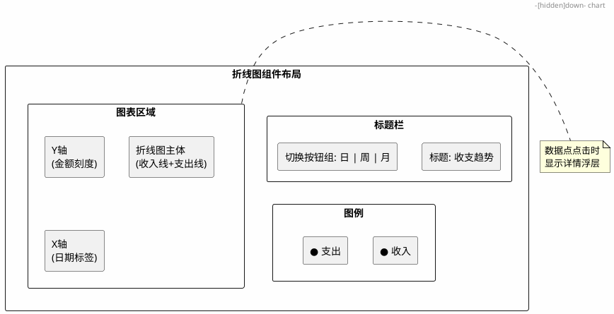
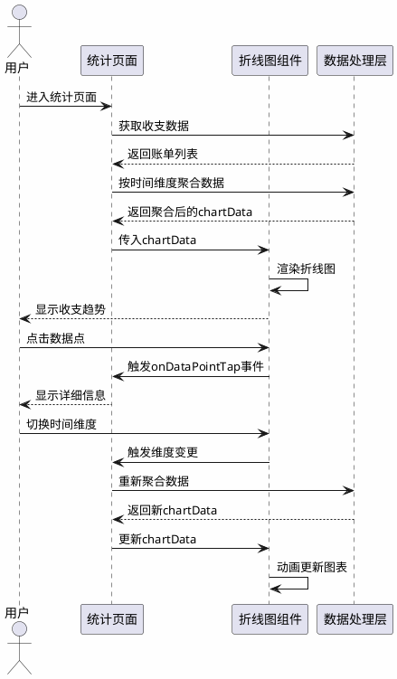

# 折线图组件需求文档

## 1. 引言

本需求文档描述了记账小程序中折线图组件的功能需求。该组件旨在以直观的可视化方式展示用户的收支统计信息，帮助用户清晰了解收支趋势变化，为财务决策提供数据支持。

折线图组件将作为通用组件，可在多个页面复用（如统计页面、账本详情页面等），支持展示不同时间维度（日/周/月）的收支趋势数据。

---

## 2. 功能需求

### 2.1 核心展示功能

#### 需求 2.1.1：折线图基础渲染

**用户故事：** 作为用户，我想要看到一个清晰美观的折线图，以便直观了解我的收支变化趋势。

**验收标准：**

1. **When** 用户打开包含折线图的页面，**the system shall** 在页面指定位置渲染一个折线图组件。
2. **When** 折线图渲染完成，**the system shall** 显示收入和支出两条折线，分别用不同颜色区分（收入为绿色，支出为红色）。
3. **When** 折线图数据为空，**the system shall** 显示空状态提示"暂无数据"。
4. **Where** 折线图支持响应式布局，**the system shall** 根据容器宽度自适应调整图表尺寸。

#### 需求 2.1.2：时间维度切换

**用户故事：** 作为用户，我想要切换不同的时间维度查看收支趋势，以便从不同角度分析我的财务状况。

**验收标准：**

1. **When** 用户点击时间维度切换按钮，**the system shall** 提供日、周、月三种时间维度选项。
2. **When** 用户选择"日"维度，**the system shall** 展示最近7天每天的收支数据。
3. **When** 用户选择"周"维度，**the system shall** 展示最近4周每周的收支数据。
4. **When** 用户选择"月"维度，**the system shall** 展示最近6个月每月的收支数据。
5. **When** 切换时间维度后，**the system shall** 平滑过渡动画更新折线图。

#### 需求 2.1.3：数据交互功能

**用户故事：** 作为用户，我想要点击折线图上的数据点查看详细信息，以便了解具体某一天/周/月的收支金额。

**验收标准：**

1. **When** 用户点击折线图上的数据点，**the system shall** 显示该数据点的详细信息浮层。
2. **When** 显示详细信息浮层，**the system shall** 包含日期、收入金额、支出金额三项信息。
3. **When** 用户点击数据点以外的区域，**the system shall** 关闭详细信息浮层。
4. **When** 用户长按折线图，**the system shall** 高亮显示最近的数据点并展示其信息。

---

### 2.2 数据处理功能

#### 需求 2.2.1：数据输入接口

**用户故事：** 作为开发者，我需要一个标准化的数据接口，以便将收支数据传递给折线图组件进行展示。

**验收标准：**

1. **When** 父组件调用折线图组件，**the system shall** 接收 `chartData` 属性作为数据输入。
2. **Where** `chartData` 数据格式，**the system shall** 包含 `dates`（日期数组）、`incomes`（收入数组）、`expenses`（支出数组）三个字段。
3. **When** 传入的数据格式不正确，**the system shall** 在控制台输出错误日志并显示空状态。
4. **When** 数据更新时，**the system shall** 自动重新渲染折线图。

#### 需求 2.2.2：数据聚合计算

**用户故事：** 作为用户，我想要看到按时间维度正确聚合的收支数据，以便进行准确的财务分析。

**验收标准：**

1. **When** 选择"日"维度，**the system shall** 按天聚合收支数据，横轴显示日期（如"3/1"、"3/2"）。
2. **When** 选择"周"维度，**the system shall** 按周聚合收支数据，横轴显示周范围（如"3/1-3/7"）。
3. **When** 选择"月"维度，**the system shall** 按月聚合收支数据，横轴显示月份（如"1月"、"2月"）。
4. **Where** 某个时间段无数据，**the system shall** 在该数据点显示0。

---

### 2.3 视觉与样式功能

#### 需求 2.3.1：图表样式定制

**用户故事：** 作为用户，我想要看到一个美观的折线图，以便获得良好的视觉体验。

**验收标准：**

1. **Where** 折线颜色，**the system shall** 收入线使用主题绿色（#07C160），支出线使用主题红色（#FA5151）。
2. **Where** 折线下方区域，**the system shall** 显示渐变填充色，增加视觉层次感。
3. **Where** 坐标轴样式，**the system shall** 显示X轴日期标签和Y轴金额刻度。
4. **Where** 网格线，**the system shall** 显示浅色水平网格线辅助阅读数据。
5. **When** 用户切换深色模式，**the system shall** 自动调整图表颜色适配深色主题。

#### 需求 2.3.2：动画效果

**用户故事：** 作为用户，我想要看到流畅的图表动画效果，以便获得更好的交互体验。

**验收标准：**

1. **When** 折线图首次渲染，**the system shall** 播放从左到右的绘制动画，持续时长300ms。
2. **When** 数据更新时，**the system shall** 播放平滑过渡动画，持续时长200ms。
3. **When** 用户切换时间维度，**the system shall** 播放淡入淡出过渡动画。

---

### 2.4 通用与复用功能

#### 需求 2.4.1：组件复用性

**用户故事：** 作为开发者，我需要一个高度可复用的折线图组件，以便在多个页面中快速集成使用。

**验收标准：**

1. **Where** 组件属性，**the system shall** 支持配置图表标题、是否显示图例、是否显示网格线等选项。
2. **Where** 组件事件，**the system shall** 提供 `onDataPointTap` 事件回调，供父组件处理数据点点击。
3. **Where** 组件样式，**the system shall** 支持通过外部样式类自定义组件外观。
4. **When** 组件被多个页面同时使用，**the system shall** 保证各实例相互独立，数据不混淆。

---

## 3. 非功能需求

### 3.1 性能要求

1. **When** 折线图渲染数据点数量在100个以内，**the system shall** 在500ms内完成渲染。
2. **When** 数据量较大（超过100个数据点），**the system shall** 进行数据采样或聚合，保证渲染流畅。

### 3.2 兼容性要求

1. **Where** 微信小程序版本，**the system shall** 兼容微信小程序基础库 2.10.0 及以上版本。
2. **Where** 屏幕尺寸，**the system shall** 适配 320px 至 414px 宽度的屏幕。

---

## 4. 界面原型

---

## 5. 数据流图

---

## 6. 技术约束

1. 微信小程序环境下，需使用 Canvas 2D API 或第三方图表库（如 ECharts for 微信小程序、wx-charts）实现折线图。
2. 组件需遵循小程序自定义组件开发规范，使用 Component 构造器。
3. 所有代码需添加完整注释，遵循项目编码规范。

---

## 7. 成功标准

1. 用户能够在统计页面看到清晰直观的收支趋势折线图。
2. 用户能够通过切换时间维度查看不同粒度的收支数据。
3. 用户能够点击数据点查看具体金额信息。
4. 组件可在多个页面复用，配置灵活。
5. 折线图渲染流畅，动画效果自然。
